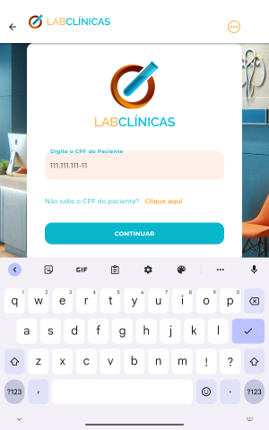

<p align="left">

  
  
  
  
  
  


</p>


### Tópicos 

:small_blue_diamond: [Sobre o Projeto](#star-sobre-o-projeto)

:small_blue_diamond: [Objetivo](#dart-objetivo)

:small_blue_diamond: [Funcionalidades](#bookmark_tabs-funcionalidades)

:small_blue_diamond: [Estrutura do Projeto](#gear-estrutura-do-projeto)

:small_blue_diamond: [Como rodar a aplicação](#arrow_forward-como-rodar-a-aplicação)

:small_blue_diamond: [Backlog](#dart-backlog)
## :star: Sobre o Projeto 

Aplicação desenvolvida durante o evento Flutter Experience, evento gratuito organizado pela Academia do Flutter (https://academiadoflutter.com.br/).

Este projeto foi desenvolvido utilizando:

:heavy_check_mark: Flutter 

:heavy_check_mark: Flutter GetIt para gerência de dependências 

:heavy_check_mark: Signals para gerência de estado 

:heavy_check_mark: Arquitetura MVVM

:heavy_check_mark: json_rest_server para simualação de um back-end.

## :dart: Objetivo

Desenvolvimento de um aplicativo para controle do processo inicial de atendimento de um laboratório, contemplando as plataformas mobile, web e desktop.

## :bookmark_tabs: Funcionalidades:

:white_check_mark: Entrada do paciente para atendimento

:white_check_mark: Administração dos atendimentos iniciados

:white_check_mark: Painel para controle dos atendimentos


## :gear: Estrutura do Projeto

A aplicação como um todo foi dividida em 4 projetos distintos, sendo:

### :arrow_forward: [Server](./server/)

- Backend da aplicação utilizando o [Json Rest Server](https://pub.dev/packages/json_rest_server)


### :arrow_forward: [Core](./lab_clinicas_core/)

Neste projeto foram centralizados os recursos compartilhados entre todos os projetos, como por exemplo:
- Constantes
- Mensagens
- Rest Client
- Tema
- Widgets genéricas como app bar, menu, etc.
- Loader
- Exceptions customizados
- Classe Either


### :arrow_forward: [Auto-Atendimento (Mobile)](./lab_clinicas_self_service/)

Este projeto contém as funcionalidades referentes ao auto-atendimento, onde todo o fluxo será iniciado pelo atendente. 
Foi desenvolvido para ser inciciado através de um tablet.

<details>
 <summary> Imagens</summary>





</details>

### :arrow_forward: [Administração dos Atendimentos (Desktop)](./lab_clinicas_adm/)

Este projeto contém as funcionalidades referentes à administração dos atendimentos. 
Foi desenvolvido para ser inciciado através do desktop.

<details>
 <summary> Imagens</summary>


</details>


### :arrow_forward: [Painel de Acompanhamento (Web)](./lab_clinicas_panel/)
Este projeto contém a funcionadade referente ao Painel de acompanhamento das senhas que serão chamada. 
Foi desenvolvido para ser inciado via navegador, a as informações das senhas serão atualizadas automaticamente no painel, utilizando uma conexão websocket com o backend.

<details>
 <summary> Imagens</summary>


</details>

## :arrow_forward: Como rodar a aplicação 

#### :warning: Pré-Requisitos

- [Git](https://git-scm.com/)
- [Dart](https://dart.dev/get-dart)
- [Flutter](https://docs.flutter.dev/get-started/install)


#### :heavy_check_mark: Clonando o Projeto

- No terminal, clone o projeto: 

  ```
  https://github.com/dgo-angelo/flutter-experience-lab-clinicas.git
  ```

#### :wrench: Variáveis de Ambiente

- :white_check_mark: Criar a pasta ./config na raiz de cada projeto**
- :white_check_mark:Criar o arquivo env.json e preenche-lo com o conteúdo abaixo:

  ```
  {
      "BACKEND_BASE_URL": "http://ip_apresentado_no_console_do_jason_rest_server:8080"
  }
  ```
- :white_check_mark: Efetuar a criação de um launcher, informando os argumentos abaixo:
  ```

  "args": [
        "--dart-define-from-file",
        ".config/env.json"
    ]
  ```


### :arrow_forward: Executando a aplicação

#### :station: Server

1) Acessar a pasta ```server``` do projeto
2) Executar o comando abaixo, que disponibilizará a api no endereço http://localhost:8080
```
json_rest_server run
```


#### :arrow_forward: Mobile, Web e Desktop

Após a configuração do launcher, basta utiliza-lo para inciar a aplicação.

## :dart: Backlog

:black_square_button: Persistência do token 
:black_square_button: Tratamento da expiração do token
:black_square_button: Geração dinâmica da senha de atendimento


<hr/>